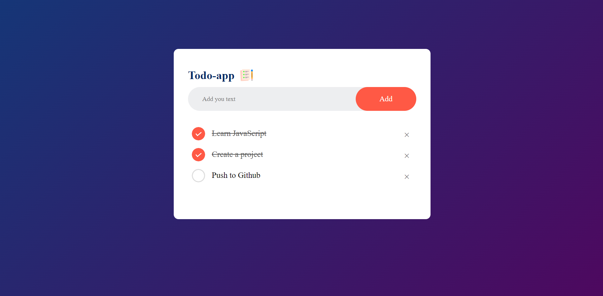

# To-Do List App

A simple To-Do List application created using HTML, CSS, and JavaScript. This application allows users to manage their tasks by adding, marking as complete, and deleting tasks. The tasks are saved to `localStorage`, ensuring they persist across page reloads.

## Features

- Add new tasks to the list
- Mark tasks as complete or incomplete
- Delete tasks from the list
- Tasks are saved to `localStorage` and persist across page reloads

## Screenshot



## Getting Started

Follow these instructions to get a copy of the project up and running on your local machine.

### Prerequisites

You will need a web browser to view the application.

### Installation

1. **Clone the Repository:**

   ```bash
   git clone https://github.com/Vishal-Kumar-Singh-18/todo-app.git
   ```

2. **Navigate to the Project Directory:**

   ```bash
   cd todo-app
   ```

3. **Open `index.html` in Your Web Browser:**

   Simply double-click on `index.html` to view the application.

## Usage

1. **Add a Task:**
   - Type the task into the input field.
   - Click the "Add" button to add the task to the list.

2. **Complete a Task:**
   - Click on a task to mark it as completed. The task will be crossed out.

3. **Delete a Task:**
   - Click the delete (×) button next to a task to remove it from the list.

4. **Refresh the Page:**
   - Tasks will remain on the list due to `localStorage`.
